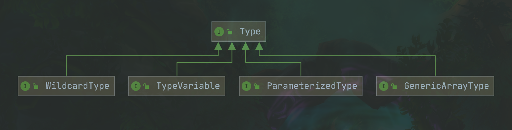

# JDK 随笔记录

## Type

Type 接口类型的直属子接口关系



1. ParameterizedType：表示的是参数化类型，例如 List<String>、Map<Integer,String>、Service<User>这种带有泛型的类型。

ParamterizedType：接口中常用的方法有三个，分别是：

- Type getRawType() -- 返回参数化类型中的原始类型，例如 List<String>的原始类型为 List.
- Type[] getActualTypeArguments() -- 获取参数化类型的类型变量或者实际类型列表，例如 Map<Integer,String>的实际泛型列表 Integer 和 String。需要注意的是，该列表的元素类型都是 Type，也就是说，可能存在多层嵌套的情况。
- Type getOwnerType() -- 返回是类型所属的类型，主要用于内部类中。例如存在 A<T>类，其中定义类内部类 InnerA<T>，则 InnerA<T>所属的类型为 A<T>，如果是顶层类型则返回 null。这种关系比较常见的示例是 Map<K,V>接口与 Map.Entry<K,V>接口，Map<K,V>接口是 Map.Entry<K,V>接口的所有者。

2. TypeVariable：表示的是类型变量，它用来反映在 JVM 编译该泛型前的信息。例如 List<T>中的 T 就是类型变量，它在编译是需要被转换为一个具体的类型后才能正常使用。

TypeVariable：接口中常用的方法有三个，分别是：

- Type[] getBounds() -- 获取类型变量的上边界，如果未明确申报上边界则默认为 Objects。例如 class Test<K extends Person>中的 K 的上界就是 Person。
- D getGenericDeclaration() -- 获取申明该类型变量的原始类型，例如 class Test<K extends Person>中的原始类型是 Test。
- String getName() -- 获取源码中定义时的名字，上例中为 K。

3. GenericArrayType：表示的是数组类型且组成元素是 ParameterizedType 或 TypeVariable。例如 List<String>[]或 T[]。

GenericArrayType：接口中只有一个方法

- Type getGenericComponentType() -- 返回数组的组成元素。

4. WildcardType：表示的是通配符泛型，例如? extends Number 和? super Integer。

WildcardType：接口有两个方法，分别是：

- Type[] getUpperBounds() -- 返回泛型变量的上界。
- Type[] getLowerBounds() -- 返回泛型变量的下界。

## 动态代理

JDK 的动态代理通过实现 InvokerHandler 接口来实现，动态代理通过接口代理模式来实现。对于代理的接口数据上限为 65535，大于该接口数量抛出异常。

通过 Proxy 类来创建代理对象，该对象最终继承 Proxy 对象和实现所有的代理接口。创建完成的 Proxy$对象中会保留接口和从 Object 继承的方法，这些方法用于 Method 类属性的方式存在。在调用该代理对象的业务方法时真正调用的是 Proxy 类中的 InvokerHandler 字段对象，即创建参数中的 InvokerHandler 参数对象。

InvokerHandler：接口只有一个方法

- Object invoke(Object proxy, Method method, Object[] args) -- 代理对象执行入口。参数：proxy - 代理类对象，method - 代理类中生成的需要执行方法，args - 执行过程中的具体参数信息。

```java
Sub instance = (Sub) Proxy.newProxyInstance(Thread.currentThread().getContextClassLoader(), new Class[]{Sub.class}, new SubInvokerHandler(() -> {}));


public final class $Proxy0 extends Proxy implements Sub {
    private static Method m1;
    private static Method m6;
    private static Method m3;
    private static Method m4;
    private static Method m2;
    private static Method m5;
    private static Method m0;

    public $Proxy0(InvocationHandler var1) throws  {
        super(var1);
    }

    public final boolean equals(Object var1) throws  {
        try {
            return (Boolean)super.h.invoke(this, m1, new Object[]{var1});
        } catch (RuntimeException | Error var3) {
            throw var3;
        } catch (Throwable var4) {
            throw new UndeclaredThrowableException(var4);
        }
    }

    public final void run() throws  {
        try {
            super.h.invoke(this, m6, (Object[])null);
        } catch (RuntimeException | Error var2) {
            throw var2;
        } catch (Throwable var3) {
            throw new UndeclaredThrowableException(var3);
        }
    }

    public final String hello(String var1, String var2) throws  {
        try {
            return (String)super.h.invoke(this, m3, new Object[]{var1, var2});
        } catch (RuntimeException | Error var4) {
            throw var4;
        } catch (Throwable var5) {
            throw new UndeclaredThrowableException(var5);
        }
    }

    public final String hello() throws  {
        try {
            return (String)super.h.invoke(this, m4, (Object[])null);
        } catch (RuntimeException | Error var2) {
            throw var2;
        } catch (Throwable var3) {
            throw new UndeclaredThrowableException(var3);
        }
    }

    public final String toString() throws  {
        try {
            return (String)super.h.invoke(this, m2, (Object[])null);
        } catch (RuntimeException | Error var2) {
            throw var2;
        } catch (Throwable var3) {
            throw new UndeclaredThrowableException(var3);
        }
    }

    public final String hello(String var1) throws  {
        try {
            return (String)super.h.invoke(this, m5, new Object[]{var1});
        } catch (RuntimeException | Error var3) {
            throw var3;
        } catch (Throwable var4) {
            throw new UndeclaredThrowableException(var4);
        }
    }

    public final int hashCode() throws  {
        try {
            return (Integer)super.h.invoke(this, m0, (Object[])null);
        } catch (RuntimeException | Error var2) {
            throw var2;
        } catch (Throwable var3) {
            throw new UndeclaredThrowableException(var3);
        }
    }

    static {
        try {
            m1 = Class.forName("java.lang.Object").getMethod("equals", Class.forName("java.lang.Object"));
            m6 = Class.forName("org.lfxu.test.proxy.Sub").getMethod("run");
            m3 = Class.forName("org.lfxu.test.proxy.Sub").getMethod("hello", Class.forName("java.lang.String"), Class.forName("java.lang.String"));
            m4 = Class.forName("org.lfxu.test.proxy.Sub").getMethod("hello");
            m2 = Class.forName("java.lang.Object").getMethod("toString");
            m5 = Class.forName("org.lfxu.test.proxy.Sub").getMethod("hello", Class.forName("java.lang.String"));
            m0 = Class.forName("java.lang.Object").getMethod("hashCode");
        } catch (NoSuchMethodException var2) {
            throw new NoSuchMethodError(var2.getMessage());
        } catch (ClassNotFoundException var3) {
            throw new NoClassDefFoundError(var3.getMessage());
        }
    }
}

```

## 国际化

java 的国际化可以使用 Locale 和 ResourceBundle 来进行资源的管理。Locale 中定义长用的地区配置，而 ResourceBundle 在进行资源的加载时可以通过传入的 Locale 对象来进行动态的资源加载。

## JAVA SE 事件

java 的事件通过 EventObject 和 EventListener 来实现。
