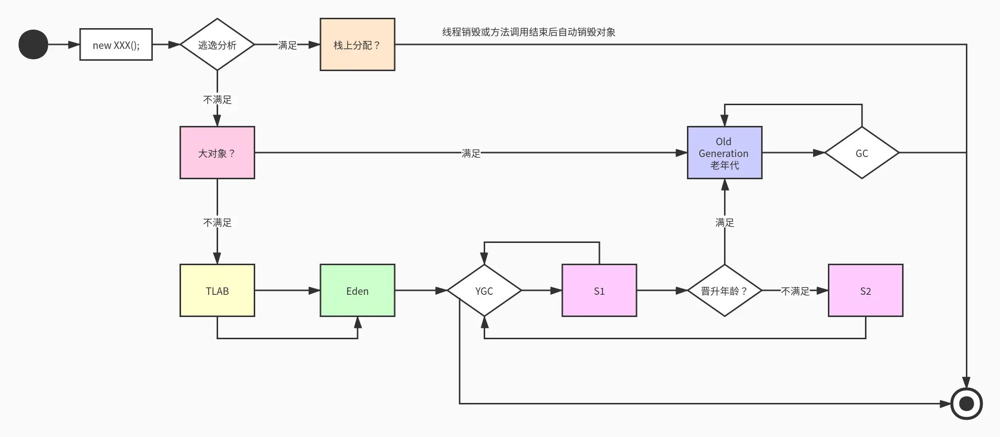

## 对象分配过程

1. 依据逃逸分析，判断是否能栈上分配？
   如果可以，使用标量替换方式，把对象分配到 VM Stack 中。如果 线程销毁或方法调用结束后，自动销毁，不需要 GC 回收器 介入。
   否则，继续下一步。

2. 判断是否大对象？
   如果是，直接分配到堆上 Old Generation 老年代上。如果对象变为垃圾后，由老年代 GC 收集器（比如 Parallel Old, CMS, G1）回收。
   否则，继续下一步。

3. 判断是否可以在 TLAB 中分配？
   如果是，在 TLAB 中分配堆上 Eden 区。
   否则，在 TLAB 外堆上的 Eden 区分配。
