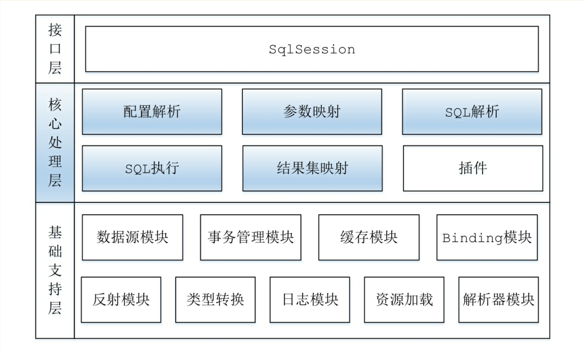
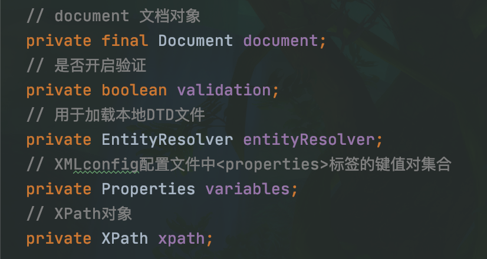

# Mybatis 流程汇总说明 记录 mybatis 的大致零碎流程说明



### configuration 配置加载流程

mybatis 加载 xml 配置流程使用，

## 基础组成模块

### 解析模块

解析模块用于解析 XML 配置配置文件数据。

#### 关键类

- XMLMapperEntityResolver

用于返回需要解析的 Mybatis 的 DTD 文件，继承自 EntityResolver 接口。

- XPathParser



该类负责将 XML 文件解析成 document 对象（每个 XML 文件对应一个 document 和 XPathParse），使用 JDK 自带 StAX 的解析功能进行解析。依赖于 EntityResolver 对象（XMLMapperEntityResolver），并且对 document 对象进行数据解析返回节点数据。  
对于 String 的数据解析 Mybatis 会进行占位符的处理。

- PropertyParser

String 数据结果解析器，该类中定义了是否开启默认值功能以及默认值分隔符。

- GenericTokenParser

通用占位符解析类，根据占位符的开启和结尾。找到占位符的字面值，并将找到的字面值传递给 TokenHandler 进行解析，然后将解析后的结果重新拼接成字符串并返回。

- VariableTokenHandler

实现 TokenHandler 接口。用于配置文件字符串配置数据占位符字面值解析，先判断本地是否有设置对应的 Properties 属性值，如果有则进行字面值的解析查找，包含默认值的处理逻辑。不存在则返回字面值（加上占位符修饰符号）。

- XMLConfigBuilder

该类主要通过 XML 配置文件来创建全局的 Configuration 核心对象。使用来建造者模式，将整个大的 XML 数据解析分割成对每个 xml 的节点来实现，每个 XML 节点都使用一个单独的方法来处理，这样实现了每个标签节点的解藕。

### 反射模块

mybatis 的反射内部封装类一个工具类。会记录对应类的字段和属性，set 方法与 get 方法。对于一个方法会通过前缀来判断是否是 get/set/is 等类型，会递归获取本身类和父类以及所有接口的方法。set 方法只会对只有一个方法的才计算在内。

#### 关键类

- Reflector

每个类都有一个对应的 Reflector 对象与之关联，里面记录需要反射类的信息。包含字段信息，get 方法，set 方法等集合。

```java
  // 原始类信息
  private final Class<?> type;
  // 包含set方法的字段名称
  private final String[] readablePropertyNames;
  // 包含get方法的字段名称
  private final String[] writablePropertyNames;
  // set方法名称集合，key - 字段名称， value - 方法信息
  private final Map<String, Invoker> setMethods = new HashMap<>();
  // get方法名称集合，key - 字段名称， value - 方法信息
  private final Map<String, Invoker> getMethods = new HashMap<>();
  // set方法对应的参数类型
  private final Map<String, Class<?>> setTypes = new HashMap<>();
  // get方法对应的返回值类型
  private final Map<String, Class<?>> getTypes = new HashMap<>();
  // 默认的构造函数
  private Constructor<?> defaultConstructor;
  // 所有属性名称集合
  private Map<String, String> caseInsensitivePropertyMap = new HashMap<>();
```

- ReflectorFactory

提供反射类获取工程，Mybatis 实现了一个默认的实现类型 DefaultReflectorFactory，默认实现的工程类中存储类已经构建过 Reflector 的缓存信息（Map）如果开启缓存设置。

### 类型转换

mybatis 类型转换负责数据库的 JDBC 类型与 JAVA 的类型映射。TypeHandler 接口定义了类型转换的统一入口。

#### 关键类

- TypeHandlerRegistry

```java
// JDBC类型对应类型转换器集合
private final Map<JdbcType, TypeHandler<?>> JDBC_TYPE_HANDLER_MAP = new EnumMap<JdbcType, TypeHandler<?>>(JdbcType.class);
// JavaBean类型对应类型转换器集合，只有明确找到JavaBean类型的转换器对象才会添加到该集合中
private final Map<Type, Map<JdbcType, TypeHandler<?>>> TYPE_HANDLER_MAP = new ConcurrentHashMap<Type, Map<JdbcType, TypeHandler<?>>>();
//
private final TypeHandler<Object> UNKNOWN_TYPE_HANDLER = new UnknownTypeHandler(this);
// 所有类型转换器Class和转换器映射
private final Map<Class<?>, TypeHandler<?>> ALL_TYPE_HANDLERS_MAP = new HashMap<Class<?>, TypeHandler<?>>();
// 不确定类型转换器集合，专指Object类型转化器
private static final Map<JdbcType, TypeHandler<?>> NULL_TYPE_HANDLER_MAP = new HashMap<JdbcType, TypeHandler<?>>();
```

每个类型转换的注册服务工具类，该类中注册了需要进行转换的类型实现类，一个 JavaBean 类型转换器可以存在多个 JdbcTyp 转换器。当存在 JavaTyp 和 JdbcType 是转换器的查找以 JavaBea 为准，JdbcType 只是可以为空。

### Mybatis 中用到的是设计模式

- 单例模式：对于某些类对象在整个系统过程中只需要一个就可以满足的情况下。为了资源的开销方面和性能考虑在这个生命周期中我们会只创建一个对象来进行服务提供。单例模式的实现分为两种：延迟加载和启动加载，延迟加载推荐使用内部类静态属性实现，如果是通过双层校验的方式来创建对于定义的单例对象需要使用 volatile 的方式来进行修饰,防止乱序执行导致的并发问题。

- 适配器模式：对于统一的接口公开，由于各种原因具体的实现类不能直接通过统一的接口进行调用。在次需要通过一层转换才能使用，这种方式就是适配器模式。  
  使用模块：日志模块

- 装饰者模式：装饰者模式，主要体现的方式为 使用组合替代继承来实现某些功能。装饰器和组件的实现都实现某个统一的业务接口，组件的实现负责具体的单一模块功能。而装饰器中包含了这个组件对象，并且对该组件添加一些装饰功能来进行业务的扩展实现。

- 建造者模式：建造者模式也叫生成者模式，是将一个复杂对象的构建过程和它的表示分离，从而可以使用同样的构建过程创建不同的表示。建造者模式是将一个负责对象的创建过程分割成一个个简单的步骤，用户只需要了解复杂对象的类型和内容，而无需关心复杂对象的具体构建过程，帮组用户屏蔽了复杂对象的内部具体构建构建细节。

## xml 解析过程

### XMLConfigBuilder 解析

Mybatis 的 xml 解析过程中，就是一个建造者模式的过程。里面有个 Settings 的节点，该节点配置能够改变 Mybatis 的一些内置配置默认值。

1.  根据配置路径创建 XMLConfigBuilder 对象，创建该对象包含了一些内部所需类数据的初始化。  
    1.1 XPathParser 的构建  
    根据传入的配置文件路径信息和 Mybatis 的 DTD 文件解析对象来进行初始化操作。初始化过程中根据传入的参数获取需要解析的 xml 文件而生成 document 文档对象
    1.2 创建空 Configuration 对象，并且将参数中的属性信息添加到新创建的 Configuration 属性集合中。

2.  XMLConfigBuilder 进行 xml 文件的解析,对于文件的解析只允许执行一次。否则抛出异常信息，对于文档的解析 Mybatis 针对每一个不同的节点标签分别进行单独解析。  
    先获取整体的 configuration 节点数据，然后对里面的每个节点进行解析。整体解析步骤模块代码

```java
  private void parseConfiguration(XNode root) {
    try {
      // 解析属性信息
      propertiesElement(root.evalNode("properties"));
      // 解析全局配置项信息
      Properties settings = settingsAsProperties(root.evalNode("settings"));
      // 配置项应用
      loadCustomVfs(settings);
      loadCustomLogImpl(settings);
      // 解析别名
      typeAliasesElement(root.evalNode("typeAliases"));
      // 解析自定义插件数据
      pluginElement(root.evalNode("plugins"));
      // 解析自定义对象工厂
      objectFactoryElement(root.evalNode("objectFactory"));
      // 解析自定义对象封装工厂
      objectWrapperFactoryElement(root.evalNode("objectWrapperFactory"));
      // 解析自定义反射工厂
      reflectorFactoryElement(root.evalNode("reflectorFactory"));
      // 配置项应用
      settingsElement(settings);
      // 加载数据库环境信息
      environmentsElement(root.evalNode("environments"));
      // 解析数据库信息
      databaseIdProviderElement(root.evalNode("databaseIdProvider"));
      // 解析自定义类型转换数据
      typeHandlerElement(root.evalNode("typeHandlers"));
      // 解析mapper的配置XML
      mapperElement(root.evalNode("mappers"));
    } catch (Exception e) {
      throw new BuilderException("Error parsing SQL Mapper Configuration. Cause: " + e, e);
    }
  }
```

2.1 重点说明  
typeAliases 解析：别名解析，对于 value 的 class 加载 Mybatis 会使用多个 classLoad 对来进行加载，对于别名的生成有两种方式。xml 配置中自定义别名或者使用 mybatis 的字段别名生成规则来创建，生成规则根据别名类中是否包含别名注解，存在则使用注解中的值否则使用别名类的简单名称。别名只能对应一个唯一的 Class 类且不区分大小写，如果存在同名不同类型的配置则抛出异常信息。

plugins 解析：对于插件的加载，插件类必须包含一个无参的构造函数，否则会初始化失败。初始化完成之后加入到 Configuration 配置 interceptorChain 集合中（内部是一个 ArrayList，查询是构建一个不可变集合信息）

environments 解析：数据库配置解析，数据库配置信息可以根据不同的环境进行不同的配置设置，但是 Mybatis 只能使用一个且必须指定其中的一个(可为空字符串)。事务类型必填信息，分为 jdbc 和 managed 两种类型（managed 类型的事务提交与回滚有管理者进行处理）根据指定的参数创建对应的事务管理工厂。接着创建数据源对象和 environment 对象，赋值给 Configuration。

databaseIdProvider：Mybatis 不能动态的处理多数据库的语法转换，通过该配置来告诉 Mybatis 当前的数据库产品类型。在执行 SQL 语句是根据该设置动态的选择对应的数据库 sql 模块。（if 标签判断 - \_databaseId）

typeHandlers：通过解析对应的 xml 节点获取数据，如果当前未设置 jdbcType 字段则根据指定的 TypeHandler 实现类中的 MappedJdbcTypes 注解数据来进行推断，而 javaType 则通过 MappedTypes 注解来进行推断获取。

mappers：解析对应的 sql 执行 xml 文件，有三种方式进行加载但是只能同时使用一直方式（resource,url,mapperClass）否则抛出异常信息。
mapper XML 配置文件使用单独的 XMLMapperBuilder 来进行解析构建，属于 BaseBuild 的子类。

### XMLMapperBuilder 解析

XMLMapperBuilder 用于解析 sql Mapper 文件，将之前解析的 Configuration 配置信息与需要加载的资源传递给 XMLMapperBuilder。由于 Mybatis 中允许存在多个 mapper 配置文件的存在，为了防止在加载过程中由于一些原因多次加载的发生。对于加载过的配置文件会存储在 configuration 的 loadedResources 中，在解析过程中发现已经加载过的 xml 文件则不会再次进行 xml 的解析。

```java
public void parse() {
// 已经加载过的配置文件则不会再次解析
if (!configuration.isResourceLoaded(resource)) {
    // 解析xml配置文件
    configurationElement(parser.evalNode("/mapper"));
    // 加入已执行集合
    configuration.addLoadedResource(resource);
    // 注册mapper接口
    bindMapperForNamespace();
}

// 处理resultMap解析失败的节点
parsePendingResultMaps();
// 处理cache-ref解析失败的节点
parsePendingCacheRefs();
// 处理statement解析失败的节点
parsePendingStatements();
}
```

configurationElement 配置解析流程

```java
// xml mapper 文件的 namespace 不允许为空否则抛出异常信息
String namespace = context.getStringAttribute("namespace");
if (namespace == null || namespace.equals("")) {
    throw new BuilderException("Mapper's namespace cannot be empty");
}
// 将当前的命名空间赋值给辅助对象
builderAssistant.setCurrentNamespace(namespace);
// 解析引用缓存配置
cacheRefElement(context.evalNode("cache-ref"));
// 解析当前命名空间的缓存配置
cacheElement(context.evalNode("cache"));
// 参数map解析，已标记过期。不关心
parameterMapElement(context.evalNodes("/mapper/parameterMap"));
// 解析resultMap标签属性信息
resultMapElements(context.evalNodes("/mapper/resultMap"));
// 解析sql标签属性信息，可根据不同数据库产品进行差异化
sqlElement(context.evalNodes("/mapper/sql"));
// 解析执行语句类型标签属性信息，可根据不同数据库产品进行差异化
buildStatementFromContext(context.evalNodes("select|insert|update|delete"));
```

- 主要流程说明

1. 缓存 cache-ref 标签解析。在解析 cache-ref 配置是，会创建一个 CacheRefResolver 对象。并且会进行缓存对象的尝试获取，如果当前引用的缓存 mapper 还没有进行加载则将该对象加入 configuration 的 incompleteCacheRefs 集合中。缓存获取成功则将缓存对象赋值给 MapperBuilderAssistant 的 currentCache，后续直接获取该缓存对象，这样就少了一次对象的引用查询。
2. 缓存 cache 标签的解析。根据配置的缓存 type 类型标签获取对应的缓存实现类型（可扩展，需要在 typeAliases 解析时候已经定义了实现类），eviction 标签设置缓存清理策略（同理可扩展实现），还有一些其它的配置等等。缓存对象创建完成之后添加到 Configuration 全局缓存集合（caches）中，并且赋值到当前 MapperBuilderAssistant 的当前缓存字段。
   - 实现 Cache 接口的缓存实现类必须包含一个接收 namespace 的有参构造函数否则抛出异常信息
   - 缓存构建过程中，会创建一个 MateObject 元数据对象（根据实现的 cache 类）,在该对象中包含 Mybatis 默认的 ObjectFactory，ObjectWrapperFactory，DefaultReflectorFactory 等自动属性信息（用户获取 Cache 的类数据信息）。将配置的信息赋值到缓存对象中，并且如果实现的 Cache 类实现了 InitializingObject 方法在赋值完属性信息之后还会执行对应的 initialize 方法。
   - 实现的缓存类，如果是默认的缓存设置（PerpetualCache）会进行缓存对象的替换，该操作是为了增强加过期缓存策略配置。即使没有设置 eviction 标签也会有默认的过期策略来实现（LruCache）。
   - 实现的缓存对象最终都会有 LoggingCache 的实现在里面。
   - 缓存中定义的控制属性最终都会已其提供该功能的 Cache 实现类进行包装。
3. resultMap 解析，并将解析完成对象加入 configuration 中。
   - 每个列都有一个对应的 ResultMapping 对象存在，在没有设置 JdbcType 的属性时会根据设置的类字段名称反射获取对应的类型
   - 构建 resultMap 对象时，如果存在 extends 指定的父级类则会创建父级类的 resultMap 对象，将父级的 ResultMapping 集合数据汇总到当前的 ResultMapping 中，并且如果当前存在构造函数配置则会将父类的构造函数 mapping 数据移除。
4. sql 标签解析，该标签解析可以根据不同的数据库来动态选择使用匹配结果。解析完成的 sql 标签结果数据会赋值到 Configuration 的 sqlElement 集合中。
5. 执行标签解析，该标签解析可以根据不同的数据库来动态选择使用匹配结果。
   - 对于该类型标签需要注意的点是对于缓存的使用 select 和非 select 是有区别的，非 select 标签默认会触发缓存的属性，而 select 标签则默认会进行缓存数据的查询操作。
   - 每个 SQL 执行语句会创建一个 MappedStatement 对象，注册到 Configuration 对象中。select 语句都会有 ResultMap 属性值，不存在显示的配置值会默认创建一个。同理 ResultMapping 一样
6. 配置文件解析完成后会对之前解析失败加入 configuration 的 incomplete 集合结果再次进行处理。

#### 重点说明

- MapperBuilderAssistant

```java
// xml 配置的命名空间
private String currentNamespace;
// xml 配置文件路径
private String resource;
// 当前mapper的缓存配置对象，可能使用的是其它mapper的缓存对象（共享）
private Cache currentCache;
// 缓存引用是否已经未验证
private boolean unresolvedCacheRef;
```

mapper 配置文件辅助对象，记录 mapper 的命名空间信息等信息。在解析响应下 mapper 标签是会赋值提供解析功能。

- CacheRefResolver

```java
// mapper 配置辅助对象
private final MapperBuilderAssistant assistant;
// 引用的缓存mapper配置文件命名空间名称
private final String cacheRefNamespace;
```

- ResultMapping

```java
// 对应的全局配置对象
private Configuration configuration;
// JavaBean的属性名称
private String property;
// SQL表字段名称
private String column;
// 字段的属性类型
private Class<?> javaType;
// 字段的表字段类型
private JdbcType jdbcType;
// 类型转换器
private TypeHandler<?> typeHandler;
// 对应的结果只能存在association/collection/case标签内
// 该属性通过id引用了另一个<resultMap>节点定义，它赋值将结果集中的一部分
// 映射成其他关联的结果对象。这样就能用于join的场景
private String nestedResultMapId;
// 对应的结果为select标签的值
// 该属性通过id引用另一个<select>节点定义
private String nestedQueryId;
// 非空值的列集合
private Set<String> notNullColumns;
// 列的前置
private String columnPrefix;
// 特殊标签数据，初始化完成之后不允许修改
private List<ResultFlag> flags;
// column拆分后的结果集，初始化完成之后不允许修改
private List<ResultMapping> composites;
// 对应的标签值
private String resultSet;
// 对应的标签值
private String foreignColumn;
// 对应的标签值
private boolean lazy;
```

每一个属性 xml 配置列对应的 Bean 对象信息，javaType 属性值未设置时 Mybatis 会通过当前的 type 类型对象反射该名称字段自动设置。XML 属性标签解析分为三类 constructor，discriminator，和其它标签类型。

discriminator：标签用于对结果做条件判断，如果列结果值满足内部定义的条件则执行其中的操作。

- constructor 标签：该标签在解析过程中会加入 constructor 的 flags 标签，如果存在 idArg 标签则也会加入 flags 集合中。使用 constructor 主要在于解析时表明该字段的名称使用 discriminator 节点的名称而不是其他类型的 property 节点值。
- discriminator 标签：该标签的解析
- 其它标签：其它类型的标签解析大部分都很简单，特殊的类型在于处理 nestedResultMapId（resultMap），当存在 association/collection/case 三种标签出现中时，并且同时存在 select 属性值则 resultMap 的定义值会被 select 属性解析结果的 id 替换，否则使用定义的属性值。
- 对于 nestedQueryId，nestedResultMapId 属性值获取时默认为引用类型，如果存在.的分割符号则不会拼接当前 mapper 文件的 namespace 前缀。（非引用类型的情况下如果存在分割符.则必须是当前 mapper 文件的 namespace 开头设置，否则抛出异常信息）
- 所有的属性值都设置完成之后根据 JavaBean 类型查找相对应的类型转换器
- 最后进行相应属性的校验，具体看代码

- XMLStatementBuilder

```java
// mapper构建赋值类
private MapperBuilderAssistant builderAssistant;
// 当前的sql执行标签节点
private XNode context;
// 是否依赖数据库类型
private String requiredDatabaseId;
```

该类用于对 sql 执行句标签进行解析，

---

- 备注：Mybatis 在对加入的类型解析是会优先查询别名注册信息，如果存在别名注册信息则使用别名注册中的类型。只有对别名集合中不存在的类型名称才会进行类型的加载。

### SqlSource 实现

##### SqlSource 对象由 SqlNode 组成，SqlNode 存在多种

Mybatis 的 SqlSource 的实现类有 5 个。RawSqlSource，DynamicSqlSource，StaticSqlSource，ProviderSqlSource，VelocitySqlSource。  
在进行 SQL 语句解析时候会判断使用哪种类型，如果存在动态条件标签的信息则使用 DynamicSqlSource 类型解析，否则使用 RawSqlSource 类型。

1. RawSqlSource：解析 SQL 配置文件时，不存在动态 SQL 的标签时使用
2. DynamicSqlSource：解析 SQL 配置文件时，存在动态 SQL 标签时使用（存在${}时也属于动态 SQL 类型）
3. StaticSqlSource：用于构建 BoundSql 对象，在 RawSqlSource 和 DynamicSqlSource 中都有用到。在创建 StaticSqlSource 时会
4. ProviderSqlSource：注解式 SQL 配置时使用，未关注
5. VelocitySqlSource：模版时使用，未关注

### 缓存实现

Mybatis 的缓存分为一级缓存和二级缓存，二级缓存通过 xml 配置中的<cache>标签来开启

1. 缓存的实现使用了装饰者模式，不同的缓存实现通过引用更底层的缓存实现来进行业务的扩展，最基础的缓存实现类 PerpetualCache。
2. 一级缓存是在 Executor 中实现的，每个 Executor 对象中保留了查询对应的缓存结果。Executor 的生命周期默认是一个会话周期，在创建 SqlSession 时进行创建,SqlSession 关闭是关闭。
   2.1 在执行更新类型操作时该缓存会被清理，该操作可以手动设置不刷新操作。而且该设置还能对查询操作进行配置，这样每次查询时就会获取最新的数据库记录。
   2.2 缓存默认的缓存周期是一个会话的生命周期，该规则可以通过 Properties 基础配置修改完 STATEMENT 类型，每次执行完查询操作都清除缓存数据。
3. 二级会话是在每个 namespace 命名空间级别下的缓存，跟会话无关。缓存刷新策略同一级缓存类似。

### 插件实现

Mybatis 的插件实现类都需要实现 Interceptor 接口，并且还要存在@Intercepts 注解的存在。该注解中可以定义多个@Signature 注解信息，每个注解对象中定义一个增强接口类（例如：Executor）和使用的函数名称与参数列表。

---

### 执行流程说明

- 执行对象（SqlSession）的创建

1. 根据配置选择对应的事务创建工厂类
2. 事务创建工厂依据传入的数据库配置，事务级别，是否自动回滚等参数来创建对应的事务类型
3. 依据配置的 ExecutorType 类型创建真正的执行 Executor 对象，包含了全局配置对象和传入的事务信息对象
4. 判断是否开启缓存配置，如果开启了缓存配置，则将 Executor 对象通过 CachingExecutor 对象进行装饰
5. 插件配置链表根据配置的顺序依次进行代理设置（注解中的@Intercepts 中包含了@Signature 的配置信息）对象创建
6. 根据 Executor 结果对象和 Configuration 等信息创建 SqlSession 返回对象信息

- Sql 语句执行

1. 根据传入的查询参数名称找到对应的 MappedStatement 对象

## 主要类属性源码说明

### Configuration

```java
// 数据库环境配置
protected Environment environment;
// 安全行界限已启用
protected boolean safeRowBoundsEnabled;
// 安全结果处理已开启
protected boolean safeResultHandlerEnabled = true;
//
protected boolean mapUnderscoreToCamelCase;
protected boolean aggressiveLazyLoading;
protected boolean multipleResultSetsEnabled = true;
protected boolean useGeneratedKeys;
protected boolean useColumnLabel = true;
protected boolean cacheEnabled = true;
protected boolean callSettersOnNulls;
protected boolean useActualParamName = true;
protected boolean returnInstanceForEmptyRow;
protected String logPrefix;
protected Class<? extends Log> logImpl;
protected Class<? extends VFS> vfsImpl;
protected LocalCacheScope localCacheScope = LocalCacheScope.SESSION;
protected JdbcType jdbcTypeForNull = JdbcType.OTHER;
protected Set<String> lazyLoadTriggerMethods = new HashSet<String>(Arrays.asList(new String[]{"equals", "clone", "hashCode", "toString"}));
protected Integer defaultStatementTimeout;
protected Integer defaultFetchSize;
// SQL执行类型
protected ExecutorType defaultExecutorType = ExecutorType.SIMPLE;
protected AutoMappingBehavior autoMappingBehavior = AutoMappingBehavior.PARTIAL;
protected AutoMappingUnknownColumnBehavior autoMappingUnknownColumnBehavior = AutoMappingUnknownColumnBehavior.NONE;
protected Properties variables = new Properties();
// javaBean反射信息工程对象
protected ReflectorFactory reflectorFactory = new DefaultReflectorFactory();
protected ObjectFactory objectFactory = new DefaultObjectFactory();
protected ObjectWrapperFactory objectWrapperFactory = new DefaultObjectWrapperFactory();
protected boolean lazyLoadingEnabled = false;
protected ProxyFactory proxyFactory = new JavassistProxyFactory(); // #224 Using internal Javassist instead of OGNL
protected String databaseId;
protected Class<?> configurationFactory;
protected final MapperRegistry mapperRegistry = new MapperRegistry(this);
protected final InterceptorChain interceptorChain = new InterceptorChain();
// 类型转换器注册信息
protected final TypeHandlerRegistry typeHandlerRegistry = new TypeHandlerRegistry();
// 别名/class映射注册对象，实现方式为Map。默认已经注册了一些内置的别名类信息
protected final TypeAliasRegistry typeAliasRegistry = new TypeAliasRegistry();
protected final LanguageDriverRegistry languageRegistry = new LanguageDriverRegistry();
// sql执行语句配置集合，key为namespace + id 值
protected final Map<String, MappedStatement> mappedStatements = new StrictMap<MappedStatement>("Mapped Statements collection");
// 所有的缓存配置信息，key 为缓存ID（mapper的namespace属性）
protected final Map<String, Cache> caches = new StrictMap<Cache>("Caches collection");
// resultMap对象集合，key为resultMap的id值（namespace + resultMap.id）
protected final Map<String, ResultMap> resultMaps = new StrictMap<ResultMap>("Result Maps collection");
protected final Map<String, ParameterMap> parameterMaps = new StrictMap<ParameterMap>("Parameter Maps collection");
protected final Map<String, KeyGenerator> keyGenerators = new StrictMap<KeyGenerator>("Key Generators collection");
// xml mapper 已价值配置集合，key为资源路径
protected final Set<String> loadedResources = new HashSet<String>();
// xml mapper sql语句定义集合，key为namespace + id 值
protected final Map<String, XNode> sqlFragments = new StrictMap<XNode>("XML fragments parsed from previous mappers");
protected final Collection<XMLStatementBuilder> incompleteStatements = new LinkedList<XMLStatementBuilder>();
// 不完整的缓存引用配置，如果配置的mapper的xml文件配置的缓存为引用类型，但是在加载该mapper配置是引用的mapper还未加载则会加入该集合
protected final Collection<CacheRefResolver> incompleteCacheRefs = new LinkedList<CacheRefResolver>();
protected final Collection<ResultMapResolver> incompleteResultMaps = new LinkedList<ResultMapResolver>();
protected final Collection<MethodResolver> incompleteMethods = new LinkedList<MethodResolver>();
// 缓存ref 映射配置，key 当前解析的mapper xml的namespace名称，value 引用的mapper namespace名称
protected final Map<String, String> cacheRefMap = new HashMap<String, String>();
```
