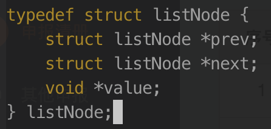
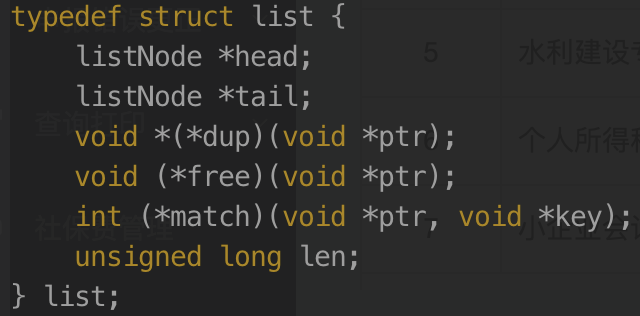
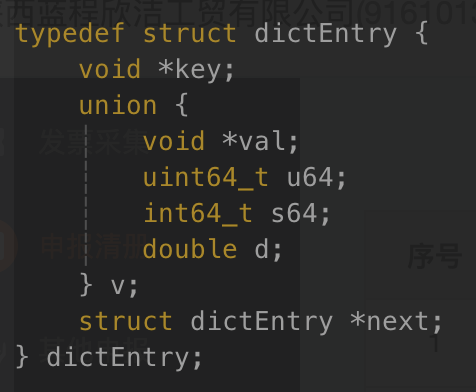

# Redis 中的数据存储结构说明

## 字符串

Redis 中字符串的底层实现数据结构为 SDS 模式，该结构中包含的属性。

- free： 未使用分配空间数
- len： 已经使用的空间数量
- buf[]：真实数据存储数组最后一位固定为\0 表示空结尾（二进制存储）。

该数据结构主要有几点优势：

1. len 节点可以提高查询字符串的长度速度，传统的 c 语言中查询一个字符串的长度需要遍历底层的数据存储数组,而 Redis 只需要查询该属性节点的值。
2. 字符串拼接优化，对比 c 默认的字符串拼接 DSD 数据结构在进行真正的拼接之前可以先判断当前的字符串可用空间是否满足需求，如果不满足则进行内存从分配获取新的大小内存数组，free 空间满足时则可以无需进行内存的重分配操作。该模式下可以减少内存的分配次数间接的提升整体的性能。
3. 字符串的截取，与字符串的拼接扩容类似。多出的空间可以为以后的拼接来使用。
4. DSD 存储方式最终存储的是个二进制数据，这样就能兼容类其它数据格式的存储。

字符串的扩容空间规则，对于空间小于 1M 的时候每次进行扩容是都会分配同等占用空间大小的 free 数量空间，对于占用大于等于 1m 的场景则每次只会分配 1M 的 free 数量空间.

## 链表

Redis 中链表节点数据结构属性。

1. listNode 属性字段
   

- prev：前置节点
- next：后置节点
- value：节点的值

通过该节点就可以组成一个双端链表。Redis 维护了一个 list 数据结构，这样操作起来更方便。

2. list 属性字段
   

- head：表头节点指针
- tail：表尾节点指针
- len：链表中包含的节点数量

list 中还有一些节点的操作函数，分别包括赋值，释放，对比。该 list 是一个无环链表，head 的 prev 的值与 tail 的 next 值都为 null。

## 字典

Redis 中的字典使用哈希表来实现。

1. dictht 属性字段
   

- table：哈希表数组
- size：哈希表大小
- sizemask：哈希表大小掩码
- used：哈希表已有节点数量

哈希表中的 table 是一个数组，里面的元素为 dictEntry 的数据。

2. dictEntry 属性字段
   

-

---

### String 内部实现数据编码

key 和 string 类型 value 值大小限制均为 512MB

- Int: 8 个字节的长整型
- Embstr: 小于等于 39 个字节的字符串
- Raw: 大于 39 个字节的字符串

### Hash 内部实现数据编码

- Ziplist: 压缩列表，默认当元素个数小于 512 个，并且所有的值都小于 64 字节时使用。
- Hashtable: 无法满足 ziplist 时使用 hashtable，因为 ziplist 此时的读写效率会下降。

### List 内部实现数据编码

有序集合，并且可以双端操作

- Ziplist: 压缩列表，默认当元素个数小于 512 个，并且所有的值都小于 64 字节时使用。
- Linkedlist: 无法使用 ziplist 时。

### Set 内部实现数据编码

无序且不可重复集合

- intset: 默认当元素个数小于 512 个且所有的值都是整数时使用。
- hashtable: 无法使用 intset 时。

### Zset 内部实现数据编码

有序且可重复集合，每个元素都有一个分数作为排序依据

- ziplist: 默认当元素个数小于 128 个且所有的值值都小于 64 字节时使用
- skiplist: 无法使用 ziplist 时。

### Bitmaps

位存储：用于判断某个事件是否存在，通过下标来进行访问和修改。

### HyperLogLog

用于进行近似数量统计，非精准类型
