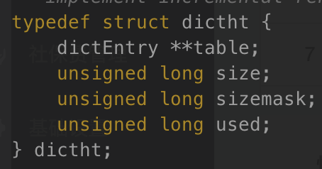

# Redis 中的数据存储结构说明

## 字符串

Redis 中字符串的底层实现数据结构为 SDS 模式，该结构中包含的属性。

- free： 未使用分配空间数
- len： 已经使用的空间数量
- buf[]：真实数据存储数组最后一位固定为\0 表示空结尾（二进制存储）。

该数据结构主要有几点优势：

1. len 节点可以提高查询字符串的长度速度，传统的 c 语言中查询一个字符串的长度需要遍历底层的数据存储数组,而 Redis 只需要查询该属性节点的值。
2. 字符串拼接优化，对比 c 默认的字符串拼接 DSD 数据结构在进行真正的拼接之前可以先判断当前的字符串可用空间是否满足需求，如果不满足则进行内存从分配获取新的大小内存数组，free 空间满足时则可以无需进行内存的重分配操作。该模式下可以减少内存的分配次数间接的提升整体的性能。
3. 字符串的截取，与字符串的拼接扩容类似。多出的空间可以为以后的拼接来使用。
4. DSD 存储方式最终存储的是个二进制数据，这样就能兼容类其它数据格式的存储。

字符串的扩容空间规则，对于空间小于 1M 的时候每次进行扩容是都会分配同等占用空间大小的 free 数量空间，对于占用大于等于 1m 的场景则每次只会分配 1M 的 free 数量空间.

## 链表

Redis 中链表节点数据结构属性。

1. listNode 属性字段
   

- prev：前置节点
- next：后置节点
- value：节点的值

通过该节点就可以组成一个双端链表。Redis 维护了一个 list 数据结构，这样操作起来更方便。

2. list 属性字段
   

- head：表头节点指针
- tail：表尾节点指针
- len：链表中包含的节点数量

list 中还有一些节点的操作函数，分别包括赋值，释放，对比。该 list 是一个无环链表，head 的 prev 的值与 tail 的 next 值都为 null。

## 字典

Redis 中的字典使用哈希表来实现。

1. dictht 属性字段
   

- table：哈希表数组
- size：哈希表大小
- sizemask：哈希表大小掩码
- used：哈希表已有节点数量

哈希表中的 table 是一个数组，里面的元素为 dictEntry 的数据。

Redis 的扩容是渐渐式的，扩容过程中两个数组都会进行数据的查找，但是只有新的数组才会进行数据的添加直到完成。

2. dictEntry 属性字段
   

- \*\*

## 数据对象结构

- redisObject 属性字段
  

- type：对象的类型（string,list,hash,set,zset）
- encoding：底层使用的数据结构类型(dsd,raw 等)
- ptr：对象存储引用
- lru：最新的修改时间，可用在对象过期策略为按过期时间是使用
- refcount：引用次数，可用于对象共享

Redis 的数据结构有多种，但是 Redis 并没有直接使用这些数据结构来实现服务的提供，而是基于这些数据结构创建了一个对象来进行服务的公开使用。根据对象来进行提供服务可以灵活的使用底层的数据结构方式，在不同的场景下使用不用的结构可以有效的提升使用效率。并且使用对象模式还可以实现很多其它的功能扩展

### String 内部实现数据编码

key 和 string 类型 value 值大小限制均为 512MB

- Int: 8 个字节的长整型
- Embstr: 小于等于 39 个字节的字符串
- Raw: 大于 39 个字节的字符串

Raw 和 Embstr 类型的实现都是基于 SDS，不同点在于 Raw 会分配两个内存区域用于存储 redisObject 和 SDS。而 Embstr 只会分配一个连续的内存区域，在该内存区域中存储了 redisObjectUnidentified 与 SDS 对象。所以在进行内存分配和释放的时候 Raw 都会多一次性能的开销，而且在系统的缓存中一个连续的内存也更有利。Embstr 的存储对象是一个只读对象，赋值完成之后无法在修改。

### Hash 内部实现数据编码

- Ziplist: 压缩列表，默认当元素个数小于 512 个，并且所有的值都小于 64 字节时使用。
- Hashtable: 无法满足 ziplist 时使用 hashtable，因为 ziplist 此时的读写效率会下降。

### List 内部实现数据编码

有序集合，并且可以双端操作

- Ziplist: 压缩列表，默认当元素个数小于 512 个，并且所有的值都小于 64 字节时使用。
- Linkedlist: 无法使用 ziplist 时。

### Set 内部实现数据编码

无序且不可重复集合

- intset: 默认当元素个数小于 512 个且所有的值都是整数时使用。整数集合内部的数据类型会存在类型的升级，一方面可以灵活的支持不同的数据大小结构类型，还能节约内存空间。在进行升级的过程中会进行类型的转换，并且老数据位置迁移。(只有存在小于和大于当前数据的时候会出现升级操作)
- hashtable: 无法使用 intset 时。

### Zset 内部实现数据编码

有序且可重复集合，每个元素都有一个分数作为排序依据

- ziplist: 默认当元素个数小于 128 个且所有的值值都小于 64 字节时使用
- skiplist: 无法使用 ziplist 时。

### Bitmaps

位存储：用于判断某个事件是否存在，通过下标来进行访问和修改。

### HyperLogLog

用于进行近似数量统计，非精准类型

## 数据库设计

### server 端

redisServer：服务端数据结构中包含真实存储数据 DB 的数组，数组的大小 dbnum 为当前数组的大小。

### 过期设计

expires：过期键字典，当中包含了设置了过期时间的 key 数据。该字典中的 key 对象是执行了设置了过期时间的 KEY,value 对象是一个过期时间戳。Redis 中所有的过期时间设置最终都会转换成一个过期时间戳来存储。

- Redis 的过期策略有 2 中方式，懒惰式删除和定期删除。懒惰删除是指在获取该 KEY 时进行判断是否已经过期，如果过期则删除该 KEY，否则放任不管它。定期删除则是没隔一段时间程序自动主动的删除过期的 KEY，Redis 中的定期删除不是一次性删除所有的过期 KEY，是一个分段式的删除模式，因为删除任务的时间是有限的在这有限的时间内只能删除一部分的数据，而剩下的则需要等待下一次任务执行时在删除。
- 过期数据还会影响数据的持有化数据
  1. RDB 模式中在进行数据的持久化是会忽略已经过期但是未删除的 KEY 对象。在进行 RDB 数据启动加载时也一样会忽略过期的 KEY 对象。
  2. AOF 模式中数据过期不会对持久化的 AOF 文件有任何的影响，只有当该 KEY 被执行过去删除时程序会主动的向 AOF 文件追加一条 DEL 命令，来显示记录该 KEY 已经被删除。而对于 AOF 文件的重写过程则和 RDB 模式一样过期的 KEY 不会写入 AOF 文件。
  3. 主从模式下，从服务器不会处理过期的 KEY 数据。数据的删除由主服务显示发送 DEL 命令进行数据的同步删除，这样就保障了主从数据的一致性

### 持久化

Redis 的持久户分为两种：RDB 和 AOF 模式。

- RDB：RDB 模式的为某个时间端的快照存储数据，该模式下的触发主要有配置触发和手动触发。配置触发可以设置为多个条件，只要其中一个满足的就会执行持久化操作。RDB 的执行又分为两种 SAVE 和 BGSAVE，两者的区别在于一个是阻塞式执行和
  子进程模式。SAVE 执行下的时候会阻塞程序响应客户端的程序运行，只有等待 SAVE 执行完才会响应客户端请求。而 BGSAVE 是开启子进程的模式进行数据的持久化，父进程能够正常的响应客户端的请求。
- AOF：AOF 模式跟 RDB 模式不同，该模式下持久化的是每个客户端的执行命令数据。服务器在执行客户端的执行完成之后，如果开启了 AOF 模式持久化，会将执行的命令追加到服务器的 AOF BUF 缓存中，然后由服务器将该缓存数据刷入到 AOF 文件。对于 AOF BUF 的输入 Redis 又 3 种选择执行方式。always-实时刷入，evelyone-在间刷入时间隔 1 秒之后刷入，no-等待系统的自动刷入。由于 AOF 模式是基于客户端的执行指令进行存储所有会存在对同一个 KEY 出现了多条指令的情况，并且随着时间的推移这种情况会越来越多导致 AOF 也越来越大。针对这样情况 Redis 提供了 AOF 的重写功能，AOF 的重写与已经存在 AOF 文件没有任何的关系，它基于的是当前数据库的内存数据进行从新开启一个新的文件。由于在进行重启的过程中 Redis 还会有客户端进行操作，所以在重写的过程中出现的新的指令会添加到 AOF 重写 BUF 中，在重写完成之后将新写入的指令追加到新的 AOF 文件中就能保障数据的一致性。

对于开启了 AOF 和 RDB 两种持久化模式下，在进行服务器的重启过程是如果存在 AOF 文件则会以 AOF 文件进行数据的重加载，因为 AOF 模式通常比 RDB 模式的数据保存的更新。  
而对于在执行持久化的同时再调用持久化命令，Redis 也有不同的处理方式。如果当前执行的是 RDB 持久化，在此期间有新的 AOF 命令调用则直接拒绝操作，而如果是 AOF 命令则是在执行完 RDB 之后在执行 AOF 命令。反之如果当前的是 AOF 模式则所有的都会拒绝。

### 数据库通知

Redis 的数据库通知是通过监听模式来实现除了常规的 CHANNEL 通知外还有两种特殊的类型，分别是键

- 空间通知：该通知会监听某一个 KEY，所有对该 KEY 的操作命令都会通知监听者。
- 键事件通知：该通知会监听某一个命令，所有执行了该命令的 KEY 都会通知监听者。

### client 端

redisClient 中包含了很多的属性信息其中主要的有

- db：客户端数据结构中有一个 db 指针，标明了当前链接的数据库是哪一个。Redis 不会告诉客户端当前的数据库是哪个库，使用时需要注意
- fd：套接字 ID，对于虚拟的套接字该值为-1，否则其他的数字都是大于 0 的数据
- queryBuf：当前客户端请求的命令缓存区，客户端在执行一系列的命令时。服务器会将这些指令先放入对应客户端的 queryBuf 缓冲区中，而不会直接进行该命令的执行。对于该缓冲区如果大小超过了一定的上限服务器会断开与该客户端的链接（默认 1G）
- argv/argc：命令在加入到缓存区之后，服务器会对其进行内容分析。然后将分析完后之后对命令放入到该两个数据中，最总通过该数据找到对应到事件处理函数来执行
- buf/bufops/reply：该 3 个数据存储到是输出缓冲区到数据，对于输出的数据字段很小时会放入到 buf/bufops 中，其中 buf 是一个字节数组而 bufops 则记录已经使用多少到字节数组。在对于响应到数据是一个很长到数据或者 buf 已经使用完成到时候，响应到数据就会放到 reply 中。该缓冲区有 2 个限制，硬性限制和软性限制。对于缓存区大小超过来硬性限制的客户端会被关闭，而软性限制则还会根据 obuf-soft-limit-reached-time 来判断是否持续了一个设置的超时时长，只有超过该设置的才会被关闭
- authenticated：身份认证标记，该数据存储结果为 0/1，0 表示未认证，1 则表示已经认证通过。默认未 0，对于开启来认证模式下，如果该值未 0 则服务器对于该客户端只对 auth 命令进行处理其它的都会拒绝执行
- flag：标明当前客户端类型，可以有多种同时存在。具体看官网
- ctime：记录客户端记录的创建时间
- lastinteraction：记录来客户和服务器的最后一次交互时间，无论是客户端发起还是服务器响应都属于
- obuf-soft-limit-reached-time：记录输入缓冲区第一次到达软限制的时间，该属性主要用户响应缓存区的关闭判断依据。如果该客户端的输出缓冲区的大小低于了软性限制大小则将该值清 0

### 主从同步

Riedis 的同步分为全量同步与部分同步，第一次同步是使用的是全量同步，该模式下主服务器会生成一个 RDB 文件然后发送给从服务器并且在次期间的命令会加入到一个缓存区后续一并发送给从服务器。而在后续的过程中出现了断开的情况时会判断是否使用全量还是增量方式进行同步。使用增量同步是基于两个服务器直接的偏移量来进行处理，但是有个前提从服务器在进行同步请求是需要带上第一次同步是接受到的主服务器 ID，如果当前的主服务器的 ID 与发送的 ID 不一样怎使用全量同步。

对于主服务器来说会为每个客户端分配一个 replication buffer 缓存区域，在首次进行数据同步过程中同步 RDB 文件是 Master 接受到的新的命令会放入 Salve 客户端的 replication buffer 缓存区中。如果超过这个大小就会断开链接，需要重新再次执行全量同步操作。该缓冲区可通过配置进行调整

对于 Master 和 Salve 的链接，如果中间出现了中断则需要通过同步的 offset 来进行判断是否需要进行全量同步。该依赖是通过 repl_backlog_buffer 进行判断，在 Master 的命令同步给每个 Salve 的 replication buffer 时还会将当前的命令写入到 repl_backlog_buffer。该缓存数据是一个环形结构写满的情况下会覆盖之前的数据，所以只要 Salve 的同步 offset 落后值没有被覆盖则只需要执行增量同步即可。

### 哨兵模式

哨兵模式（Sentinel）是 Redis 高可用的一种实现，在一个 Redis 的在线服务中通过哨兵来对当前的服务进行监控。在出现了服务异常的时候能够进行服务的异常转换已提供正常的服务提供。

1. Sentinel 应用是也是一个 Redis 服务只是运行的业务不同，在启动时不会有持久化数据的加载以及提供的服务命令列表的差异化。每个 Sentinel 服务里面都配置了需要监控的 Master 服务应用信息，这样 Sentinel 服务在启动完成之后就能通过配置的数据知道需要监控的 Master 服务有哪些。
2. 在获取到对应的 Master 服务之后会跟对应的服务创建一个链接和订阅，链接创建完成之后通过 INFO 命令来获取对应 Master 和它自己下面的 Salve 节点信息。
3. 如果存在多个 Sentinel 应用，每个 Sentinel 应用通过监控的 Master 节点进行数据的交换和发现，在发现了其它的 Sentinel 服务之后彼此直接会创建一个链接。

每个 Sentinel 服务每隔 1 秒钟会向所有的服务发送一个心跳检测，根据每个服务返回的响应结果（超时）来判断对方是否存活。对于服务的存活判断 Redis 有两种模式主观下线，客观下线。

1. 主观下线：主观下线指的的是在一个固定的时间内都没有收到存活的响应（超时）就会认为对应的服务下线，超时时间可以通过配置来进行设定。该超时时间对于所有的服务都有效（Master,Salve,Sentinel)
2. 客观下线：客观下线只有对 Master 服务有效，每个 Sentinel 在对应的监控 Master 节点认为主观下线时会询问其它监控来该 Master 节点的 Sentinel 服务当前的 Master 状态。在收到一定数量的都是下线状态是就会改为客观下线状态，用于判断客观下线数量的信息可以通过配置进行设置并且每个 Sentinel 可以不一样

在判断出 Master 节点下线之后就会选举出一个 Sentinel 领头节点，由该领头节点来执行主节点的故障转移

1. 在线的每个 Sentinel 都有成为 Leader 节点的资格
2. 每个 Sentinel 在进行一次选择时都会对自己内部的配置纪元数据进行+1 操作
3. 在一个纪元内每个 Sentinel 都有一次将其它 Sentinel 节点设置为 Leader 节点的机会，并且不能在修改
4. 每个发现主服务客观下线的 Sentinel 都会发现将自己设置为 Leader 节点的请求
5. 每个 Sentinel 在发送自己成为 Leader 节点之后，在接受到其它的 Sentinel 响应时。通过响应的数据来判断是否是由自己获取了资格，首先判断响应的纪元值如果纪元值相同是在判断返回的 RUNID 是否为自己的 RUNID 值
6. 如果某个 Sentinel 被半数以上的节点都设置为 Leader 节点后，那么这个 Sentinel 就会成为 Leader 节点

因为需要半数以上的 Sentinel 节点同意成为 Leader，所以在一个纪元内就不会出现两个 Leader 的情况。如果在给定的时间内没有一个 Sentinel 被选为 Leader 节点，在过一段时间后再次重新发起选举直到选出一个 Leader 为止

### 集群模式

集群模式（Cluster）是 Redis 高可用的一种方式，集群中的每个主节点负责一部分的槽节点数据存储。每个集群的槽数固定为 16384，由集群里的所有主节点分摊。

集群模式运行的实例按照 Cluster 服务运行，和单机版 Redis 应用类似。每个集群都启动是如果存在持久化数据都会进行加载，单机版提供的服务命令也都会进行加载。不同的是集群中的机器默认开始都是隔离的，彼此互不知道对方的存在，需要通知集群应用将其它的集群服务加入自己的集群中。而且这个时候集群中的应用都是处于下线状态因为集群的槽还没有进行分配，在执行完槽的分配完之后整个集群才能进行上线提供服务。

对于槽分配是每个槽位都要分配到某个集群应用上，如果由一个槽没有进行分配该集群也是处于下线的状态。每个应用会记录本身需要负责的槽位数，而且还会记录所有槽的分配信息。因为在进行后续操作时，如果执行的 KEY 不在自己负责的槽需要通知客户端进行重定向到负责的应用机器上。每个应用节点在收到自己的分配槽信息之后，会通过消息通知其它节点这样在通过一段时间后所有的机器都将知道所有的槽分配信息。

集群模式下，客户端也要使用集群模式客户端。因为有些操作是集群模式下才会有，比如在执行一个键添加时如果当前操作的键不在当前操作的应用机器上。服务端回发送一个 MOVE 操作响应，通知客户端链接键对应的槽服务应用。而且在进行集群的扩容时当有新的主节点加入，会进行槽节点的从新分配。在分配的过程中如果执行的 KEY 不在源节点上，源节点会发送一个 ASK 响应给客户端。客户端在拿到这个响应是会对重定向的机器先执行一个 ASKING 命令，然后在执行需要执行命令。默认下对于不在本身负责的槽节点集群机器会通知客户端进行重定向操作，但是在执行从分配时是个特例，服务器在收到 ASKING 时会破例执行命令的操作。该 ASKING 执行是一个一次性的指令，

集群模式下的服务下线是通过彼此的通信来进行控制，当某一个主节点长时间没有响应其它节点的存活通信时。进行存活通信的节点就会将该节点标为下线状态然后发送下线消息到集群中，如果存在半数的主节点都任务该节点下线就会进行故障的迁移。在迁移的主节点下找出一个从节点进行升级为主节点，然后该升级的节点将会替换下线的节点进行分配槽数据的服务提供。（每个从节点都有机会升级为主节点）

## 杂项

redis-benchmark -t set -q
- redis-benchmark 命令可以测试服务器的QPS上限，通过-P 管道命令可以获取最大的QPS值
