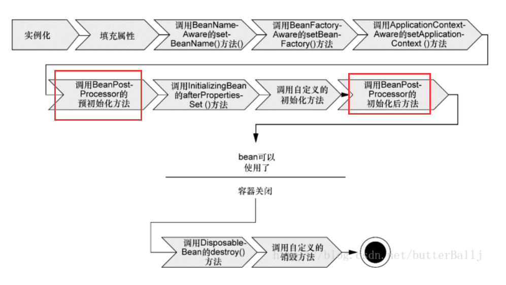

## BeanFactoryPostProcessor

BeanFactoryPostProcessor 接口定义的实现可以在容器的启动阶段对 BeanDefinition 的保存数据做一些修改，由于实现类可以有多个对于有执行先后顺序的类可以实现 Ordered 接口来确定执行的顺序优先级。在 Spring 中提供了一些内置的实现类来实现一些特殊的业务处理。

### PropertyPlacoholderConfigurer

该 BeanFactoryPostProcessor 用于对 BeanDefinition 的配置属性占位符数据进行解析和替换，Bean 配置对象在第一阶段的 BeanDefinition 解析和注册到 BeanDefinitionRegistr 中后定义中的占位符信息还未被处理，需要该类进行解析和替换。这样在后续的 Bean 实例初始化的时候属性值就是已经被替换完的值。

该类不仅仅只会使用配置的 Property 配置文件的内容进行解析和替换，还会使用 System 的属性来进行替换。对于 System 的属性有 3 种使用模式来进行定义使用方式。

### PropertyOverrideConfigurer

该 BeanFactoryPostProcessor 用于对 BeanDefinition 定义的配置属性进行替换操作。例如配置了某一个 bean.PropertyName=xxx，这样在本地之前通过 PropertyPlacoholderConfigurer 进行占位符替换的属性的值最终会被 xxx 替换，而不是占位符中解析出来的值。

### CustomEditorConfigurer

对于配置文件来说，所有的数据都是字符串信息。所有在 Spring 中解析完的数据需要通过一种方式来解析这些字符串然后转换成对应的数据类型才能赋值给 Bean 的属性字段，PropertyEdit 就是这样的一个工具类型，Spring 内置了很多的基本数据类型转换对象。而对于一些不支持的数据类型就需要自定义实现来处理，自定义的类可以通过继承 PropertyEditSupport 以避免需要实现 PropertyEdit 接口里的所有方法。

自定义实现的 PropertyEdit 需要通过 CustomEditorConfigurer 进行服务的注册，这样才能在数据转换的时候进行使用。

### CustomScopeConfigurer

自定义 Scope 对象注册类，通过该配置类注册自定义的 Scope 实现类。在此注册类之后 Bean 定义时 Scope 的值就可以选择使用该注册的类型。

## BeanPostProcessor

BeanPostProcessor 接口定义的实现可以在对象实例化的阶段对 Bean 做一些业务的扩展，由于实现类可以有多个对于有执行先后顺序的类可以实现 Ordered 接口来确定执行的顺序优先级。在 Spring 中提供了一些内置的实现类来实现一些特殊的业务处理。

被 BeanPostProcessor 依赖的 Bean 不会被执行 BeanPostProcessor 的流程，应该在初始化 BeanPostProcessor 的 Bean 时被依赖的 Bean 也会被初始化完成。此时 BeanPostProcessor 还未被初始化完成

**BeanPostProcessor**

- org.springframework.beans.factory.config.BeanPostProcessor#postProcessBeforeInitialization

对所有的单例 bean 对象，在任何 bean 初始化回调（如 InitializingBeanafterPropertiesSet 或自定义 init-method）之前，将此 BeanPostProcessor 应用于给定的新 bean 实例。

- org.springframework.beans.factory.config.BeanPostProcessor#postProcessAfterInitialization

对所有的单例 bean 对象，在任何 bean 初始化回调（如 InitializingBeanafterPropertiesSet 或自定义 init-method）之后，将此 BeanPostProcessor 应用于给定的新 bean 实例。

### InstantiationAwareBeanPostProcessor

该 Processor 与其它类型 BeanPostProcessor 的接口类型实现不同，它在实例话 Bean 对象之前进行调用。如果当前的 BeanDefinition 能通过该 Processor 进行实例化对象，则直接返回该实例化后的对象不在走后续的流程。

### AutowiredAnnotationBeanPostProcessor

该 Processor 用于对 Bean 定义中使用了@Autowired 的 bean 对象进行依赖对象的注入，该注解可以使用在 Field 或者 Method 上。

Autowired 一般需要搭配 Qualifier 进行使用，因为 Autowired 是按照类型进行匹配来实现依赖的注入。如果一个容器中通过类型中存在多个实现类 Autowired 就无法进行处理，这个时候就需要 Qualifier 进行辅助告诉容器使用哪个实现类，Qualifier 实际上是 byName 的自动绑定的注解。

### CommomAnnotationBeanPostProcessor

该 Processor 用于对 Bean 定义中使用了@Resource 的 bean 对象进行依赖对象的注入，该注解可以使用在 Field 或者 Method 上。

## 碎片信息

### Bean 整体初始化流程

<!--  -->

Spring 的 Bean 在初始化过程中内部传递的不是直接的 Bean 实例对象，而是一个 BeanWrapper 对象。该对象对实例对象进行一层封装，以便与 Spring 对其做一些扩展和自定义处理。BeanWrapper 实现了一些接口，这些接口中提供了对 Bean 实例操作的辅助对象和所需的配置对象等

### 各色各样的 Aware

Spring 提供了内置服务对象的依赖注入，定义的 Bean 类型只需要实现所需注入依赖对象的 Aware 接口。在初始化实例的过程中 Spring 将会自动注入这些对象

### Resource 和 ResourceLoader

在 Spring 的资源初始化加载中，通过 Resource 来定义需要加载的资源类型，每个不同的类型都有具体的 Resource 实现类来进行处理。

ResourceLoader 负责的是对不同的 Resource 来进行加载处理同理也是有不同的类型实现类来进行，与 Resource 的实现类一一对应。

### prototype 类型 Bean 的获取

Scope 类型为 prototype Bean 在每次向 BeanFactory 获取时，BeanFactory 都会返回一个新的 Bean 实例对象。在使用的过程中如果某个 Bean 的方法用于提供该类型的 Bean 有多种方式可以实现该需求。

- lookup-method 配置
  当一个 Bean 的方法被定义为 lookup-method 时，该方法将不在执行原有的业务。因为被 lookup-method 修饰的方法称为 方法注入，通常用于返回一个 Scope 为非 Single 类型的 Bean 对象实例。
- 实现 BeanFactoryAware 接口
  实现类该接口的 Bean 对象在初始化的过程中 Spring 会将当前 BeanFactory 对象注入到该 Bean 实例中，通过注入的 BeanFactory 来进行 prototype 属性 Bean 对象的获取提供。
- 使用 ObjectFactoryCreatingFactoryBean
  通过 ObjectFactoryCreatingFactoryBean 的实现实际上与第二种方式一样，只是这个实现是 Spring 内部提供的。而且使用它我们可以无需跟 BeanFactoryAware 进行交互。

### 方法替换

Spring 提供了一种方式可以替换 Bean 中某个方法的实现，使用 replace-method。该配置用于指定的方法被需要替换的 Bean 来进行替代，执行该方法的逻辑将有被指定的替代 Bean 来执行。

### Aop

#### Pointcut

Pointcut 是 Aop 中用来判断目标类是否需要进行代理的判断依据

Pointcut 中通过 ClassFilte 和 MethodFilter 进行目标对象的匹配过滤。ClassFilte 针对的是类级别，MethodFilter 针对的是方法级别。其中 MethodFilter 级别中还分为两种类型，静态方法类型于动态放类型。静态方法类型匹配的是方法和目标类，动态方法匹配还需要加上运行时刻的参数匹配，两者通过 isRuntime 方法返回结果来判断使用类型。

Spring 提供了多种的 Pointcut 解析实现类型以支持不同需要场景下的使用。

- NameMatchMethodPointcut  
   根据方法名称进行匹配切入代理，该方式支持模糊查询。由于是基于名称匹配所以对参数的场景不支持区分

- JdkRegexpMethodPointcut/Perl5RegexpMethodPointcut  
   当基于名称模糊匹配也不满足的情况下可以使用正则匹配来进行判断，正则的实现有 2 种可以自行选择

- AnnotationMatchingPointcut  
   基于使用了特定类型注解的类/方法来进行切入点的匹配。分为 3 种情况：类匹配，方法匹配，类+方法匹配

- ComposablePointcut  
   提供逻辑运算支持匹配，它提供了 Pointcut 直接的"并"和"交"运算

- ControlFlowPointcut  
   其它类型的 Pointcut 类型，只要找到对于的 Pointcut 点。每次调用时候无论调用者是哪个都会执行切入的逻辑运算，而 ControlFlowPointcut 不同它可以设置只有某个类型地方调用是才会执行切入的逻辑运算

#### Advice

Advice 分为 pre-class 和 pre-instance 两种类型

pre-class 类型 Advice，不会为目标对象保存任何的状态或者添加新的特效，通常只做方法拦截功能所以该 Advice 可以在所有的目标对象间共享。

Introduction 是 Spring 中唯一的 pre-instance 类型 Advice，pre-instance 类型的 Advice 会为不同的目标对象保存不同的状态以及相关的逻辑，因此该类型 Advice 不能在对象间共享。为了实现添加新的行为这就需要申明相对于的接口和实现类。这样在通过特定的拦截器将该接口定义和实现类的逻辑附加到目标对象上，这样目标对象（代理对象）就有了新添加的行为。实现该拦截功能的类就是 IntroductionInterceptor，该接口继承了 MethodInterceptor 和 DynamicIntroductionAdvice

#### Advisor

Advisor 分为 IntroductionAdvisor 和 PointcutAdvisor 两种类型。IntroductionAdvisor 只能应用于类级别的对象拦截，并且只能使用 Introduction 类型的 Advice。

1. Introduction 可以为已经存在的对象添加新的行为，所以只能应用于对象级别的拦截。在执行 IntroductionUnidentified 的织入过程中，不需要指定 Pointcut，而只需要指定目标接口类型。
2. Introduction 只能通过接口为当前对象添加新的行为，所欲在织入是需要指定新织入的接口类型。

#### ProxyFactory

Spring 的代理实现类型分两种情况：JDK 的接口动态代理，目标类的 CGLB 代理。

是否使用 CGLB 代理方式有三种判断条件

1. 没有实现任何一个接口（SpringProxy 接口忽略）
2. ProxyFactory 的 proxyTargetClass 设置为 TURE 类则使用 CGLB 模式
3. ProxyFactory 的 optimize 设置为 TRUE。

- 在进行 Introduction 的对接创建时，只能通过 setInterfaces 方法来指定需要织入的新行为接口

AdvisedSupport：Spring 的代理工厂通过这个对象来进行选择使用 JDK 还是 CGLB 等类型，所以说是个数据载体对象。AdvisedSupport 继承 ProxyConfig 和实现 Advised 接口，其中 ProxyConfig 中包含了生成代理对象的控制信息。Advised 承载了生成代理对象所需要的必要信息。

1. exposeProxy：设置是否在代理过程中将代理对象放入上下文中，这样设置了放入上下文中的 Bean 代理。后期使用是可以通过 AopContext.currentProxy()来获取当前的代理对象实例，用于在方法中通过 this 调用自身方法而又需要执行切面方法时使用。

Advised：中包含了 Advisor 等信息，用于控制对哪些对象需要执行切入已经需要织入的逻辑有哪些。

#### ProxyFactoryBean

ProxyFactoryBean extender ProxyCreatorSupport，最终会继承 ProxyConfig 所以包含了代码需要实现的信息

ProxyFactoryBean 用于 FactoryBean 类型工厂 BEAN 的实例创建
